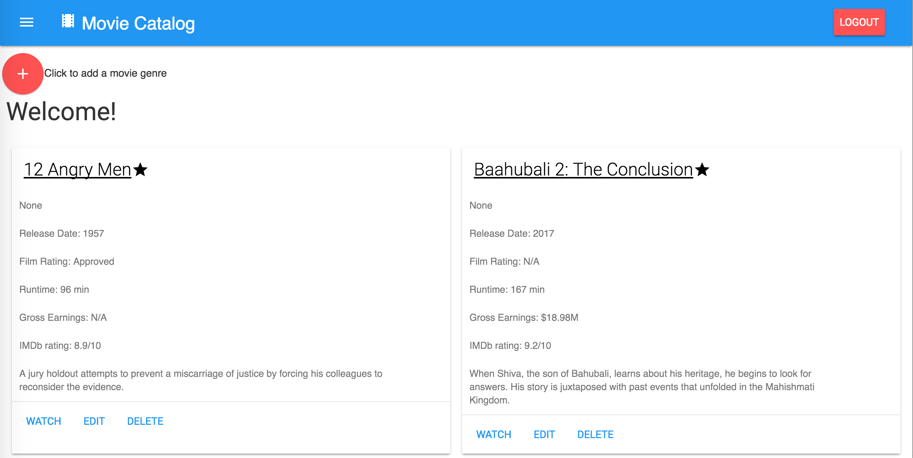

# Item Catalog

## Project 5 Overview

The objective of this project was to create a web application that provides a list of items within a variety of categories and integrate third party user registration and authentication. 

The project consists of four parts:

1. the HTML(structure of the pages)
2. the CSS (the style of the pages)
3. the Flask Application (to put it online)
	* it includes authentication & authorization to allow users to login before making changes
4. the database (to store and organize the information)

___

## To Set up and Run

### Locally 

* [Clone or download this repository](https://github.com/eddiebrunson/FSND-Item-Catalog.git)
* Ensure you have or download Python [Download Python here](https://www.python.org/downloads/)
* Ensure you have or download both [Vagrant]((http://www.vagrantup.com/downloads.html) and [Virtual Box](https://www.virtualbox.org/wiki/Downloads) onto your computer.

1. Load the Virtual Machine:

* Change directory to the Vagrant project by entering `cd project/vagrant` into the command line
* To start Vagrant (power up your virtual machine) enter `vagrant up` into the command line 
* Log into the virtual machine by entering `vagrant ssh` into the command line 
* Enter `cd /vagrant/catalog` to get inside the project directory 

2. Connect to the application

* To start type `python app.py`

3. To browse the application:

* Open browser and enter `http://localhost:5000/`

___

## Screenshots

### Item Catalog 

  

---

## Sources

* Udacity Discussion Board
* [Pep8 Python Style Guide](https://www.python.org/dev/peps/pep-0008/)
* [Udacity's Fullstack Foundations course](https://www.udacity.com/course/full-stack-foundations--ud088)
* [Udacity's Authentication & Authorization: OAuth course](https://www.udacity.com/course/authentication-authorization-oauth--ud330)
* [Item Catalog: Getting Started Guide](https://docs.google.com/document/d/1jFjlq_f-hJoAZP8dYuo5H3xY62kGyziQmiv9EPIA7tM/pub?embedded=true)
*[Material Design](https://material.io)
*[SQLAlchemy Image-Attach](http://sqlalchemy-imageattach.readthedocs.io/en/1.0.0/guide/context.html)

